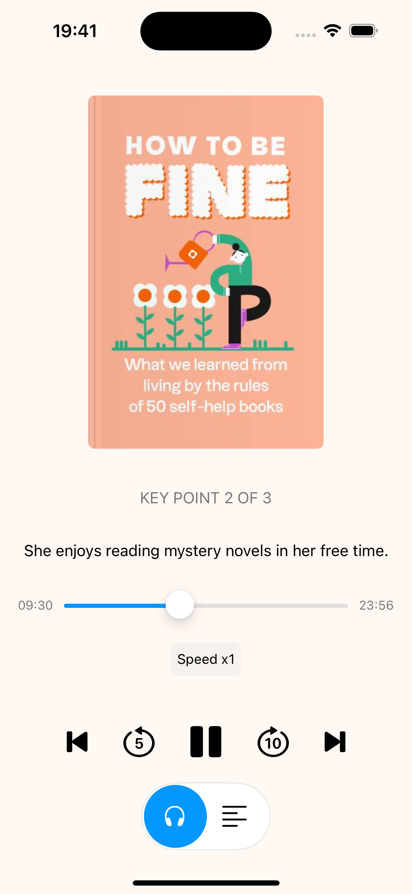
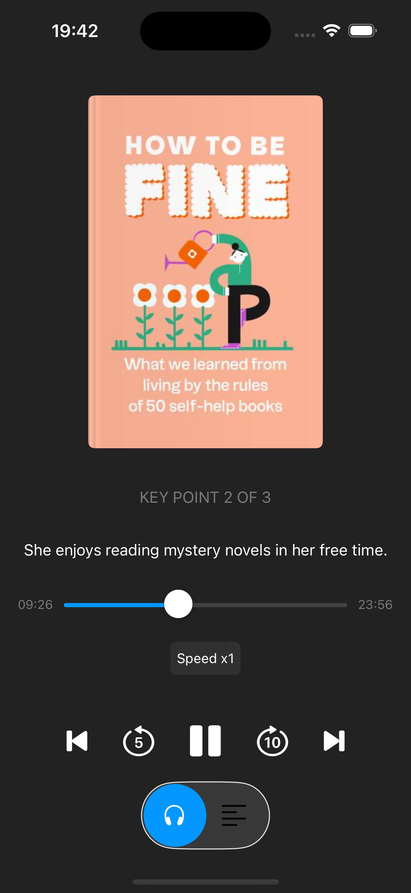

# Book Summary App

# Functionality

- **Play/pause audio**
- **Switch between different parts of the summary** (e.g., chapters)
- **Adjust playback speed**
- **Rewind/fast forward audio by a certain time interval**

# Technical Requirements

- **SwiftUI**: For creating the UI
- **Swift Concurrency**: For asynchronous programming
- **TCA**: For building a flexible architecture

# Result

    
    

